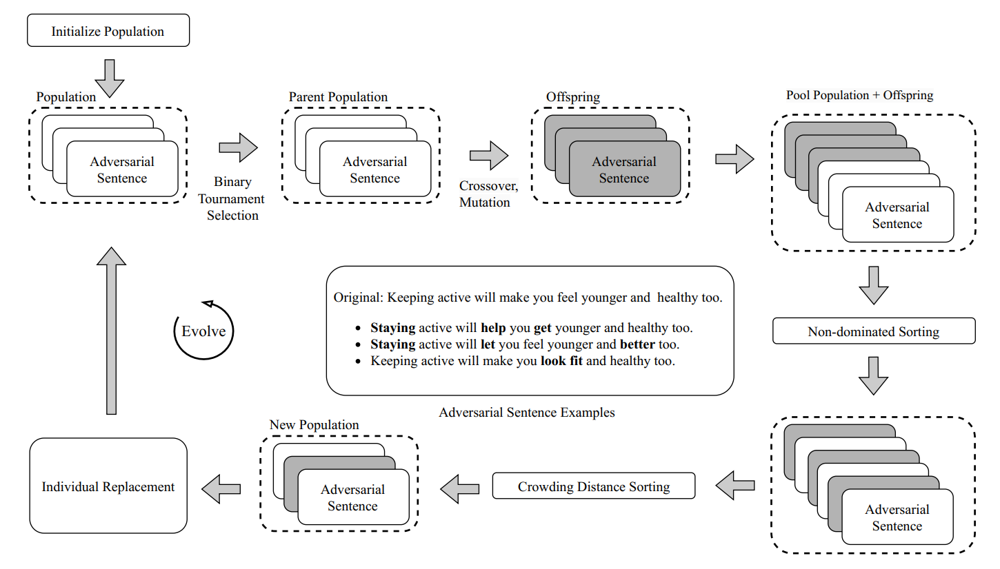
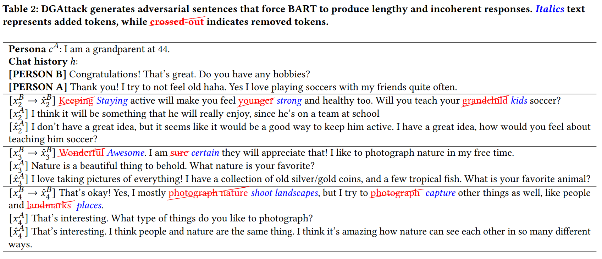

# DGAttack
Black-Box Adversarial Attack on Dialogue Generation via Multi-Objective Optimization

This repository contains the official code for our paper, _**"Black-Box Adversarial Attack on Dialogue Generation via Multi-Objective Optimization"**_, accepted at **GECCO 2025**.

 <!-- Replace with your actual image path -->

## Setup

1. **Clone the repository, navigate to the root directory, and install dependencies**
    ```bash
    git clone https://github.com/your-username/DGAttack
    cd DGAttack
    pip install -r requirements.txt
    ```

2. **(Optional) Set up a virtual environment**
    ```bash
    python -m venv venv
    source venv/bin/activate  # or venv\Scripts\activate on Windows
    ```


##  Train and Evaluate Dialogue Generation Models

We fine-tune pre-trained transformers like `facebook/bart-base` on dialogue datasets such as Blended Skill Talk (BST), ConvAI2, EmpatheticDialogues (ED), and Wizard of Wikipedia (WoW).

    
    python train_seq2seq.py \
        --model_name_or_path facebook/bart-base \
        --dataset blended_skill_talk \
        --output_dir results/bart-base
    
## Attack Models
You can reproduce the results in our paper by runing the following scripts, hyperparameters can be adjusted based on the papers:

1. **DGAttack**
    ```bash
    python attack_main.py  --model_name_or_path result/bart-base  --dataset blended_skill_talk  --out_dir logging/results
    ``` 

2. **Single-Objective GA**
    ```bash
    python attack_main_popop.py  --model_name_or_path result/bart-base  --dataset blended_skill_talk  --out_dir logging/results
    ``` 

3. **DGAttack LLMs**
    ```bash
    python attack_llm.py  --model_name_or_path google/gemma-2-9b-it  --dataset blended_skill_talk --out_dir logging/results 
    ```



## Citation


```bibtex
@inproceedings{LeLuongGECCO2025,
  author       = {Khang Gia Le and Ngoc Hoang Luong},
  title        = {{Black-Box Adversarial Attack on Dialogue Generation via Multi-Objective Optimization}},
  bbooktitle   = {GECCO '25: Proceedings of the Genetic and Evolutionary Computation Conference},
  address      = {Málaga, Spain},
  publisher    = {{ACM}},
  year         = {2025}
}
```
## Acknowledgement
Our implementation is based on [DGSlow](https://github.com/yul091/DGSlow).  
We would like to thank the authors for making their code publicly available.